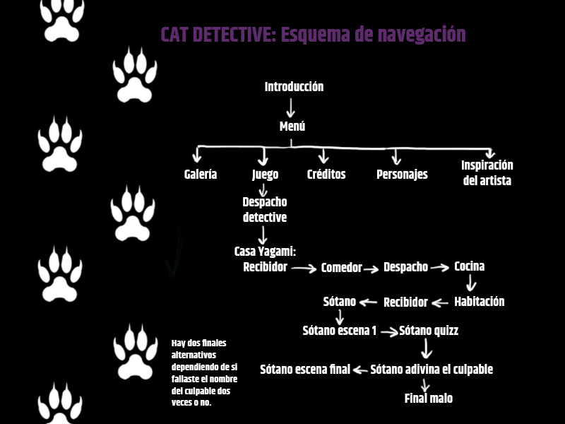

## CAT Detective

Proyecto de Creación Multimedia Interactiva de la  Facultad de Bellas Artes de la Univesidad de Granada

# 1 Datos 

**Titulo** : Cat Detective

**Web:**   https://github.com/mjgonzalezdiaz/mjgonzalezdiaz.github.io

**Autor:**  María José González Díaz

**Resumen** : En este proyecto he desarrollado un juego de misterio. El protagonista del juego es un detective que tiene que resolver un crimen junto con la ayuda del jugador. El jugador tendrá que buscar pistas, resolver un breve cuestionario y, finalmente, desvelar el nombre del culpable. 

**Estilo/género:**  Novela visual/juego

**Logotipo** : El logo que muestro es mi logo personal que he usado como firma. Este logo se muestra en el menú del juego. 

**Resolución:** 800x600px tamaño fijo, ajustándose a la pantalla.

**Probado en:** Internet explorer, Google Chrome  (indicar dónde has probado que funciona: ej. Google Chrome / MS Edge... /móviles android )

**Tamaño proyecto:** 41 MB 

**Licencia** Este proyecto tiene una Licencia CC Reconocimiento Compartir igual (CC BY-SA)

**Fecha** : 14/05/2020

**Medios** (donde se tiene presencia relacionada):

- Github

# 2. Memoria del proyecto 

### 2.1 Storyboard: 

En la primera pantalla aparece una introducción que nos lleva al menú principal donde encontramos varias opciones como los créditos, la galería o jugar.

El juego es una novela visual en la que el protagonista es un detective que tiene que resolver un caso en la mansión de los Yagami. 
A lo largo del juego, el jugador tendrá que buscar pistas para conseguir resolver el caso por sí mismo. 

Después de haber interactuado con todos los personajes y explorar las diferentes salas, el detective irá a la última pantalla en la que se le harán unas preguntas que el jugador debe responder. Tras esto, aparecerá un campo de texto en el que se tendrá que introducir el nombre del culpable. Si el jugador falla dos veces, el juego le llevará a un final alternativo en el que se le comunica que ha perdido. Si se acierta con el culpable, se podrá ver una escena final donde se resuelve el caso y el jugador gana. 

### 2.2. Esquema de navegación 

# 3. Metodología

Metodología de desarrollo de productos multimedia basado en una metodología de UX (User Experience)

### Etapa 1: Ideación de proyecto

**Investigación de campo** (propuestas inspiradoras para el proyecto)

- Juegos del Profesor Layton (https://www.nintendo.es/Juegos/Portal-de-Nintendo/Portal-para-la-serie-Layton/Portal-de-la-serie-Layton-627605.html)
- Serie de animación del Detective Conan (https://www.detectiveconanworld.com/wiki/Anime)

**Motivación de la propuesta** 

Este  proyecto es interesante porque se ha creado un producto que puede ser de interés para el público joven al que le guste la novela de misterio. Se ha desarrollado un juego que, sin ser muy complejo, puede asegurar momentos de diversión a los jóvenes. 

**Publico / audiencia**

- Orientado al público adolescente que le gusten las novelas visuales e interesados en el mundo del misterio.

### Etapa 2: Desarrollo / actividades realizadas

(qué soluciones has planteado y cómo se han resuelto: juego, galería de fotos, grabación de video, etc.)

- Juego: en el juego, aparte de introducir diferentes escenas con diálogos, he introducido elementos que el jugador tiene que buscar. En el último elemento que tiene que encontrar el jugador, incorporé un contador de tiempo. Después de esto, hay un pequeño quizz de tres preguntas, que llevan a una pantalla donde el jugador tiene que introducir el nombre del culpable en un campo de texto. Si el jugador falla dos veces habrá perdido el juego. 

- Vídeo: el vídeo lo he incorporado en la opción de inspiración que aparece en el menú principal. Este vídeo fue editado con Avidemux. Se eliminaron algunas partes del vídeo que no eran necesarias para disminuir el peso del archivo. 

- Instrucciones y ayuda al usuario: el juego es muy intuitivo y en las partes en que van apareciendo las pistas, el quizz y el campo de entrada se dan indicaciones para que el jugador sepa qué tiene que hacer.  

- Menús y elementos de navegación (botones): en el juego hay un menú principal que muestra varias opciones. A lo largo del juego los botones son esenciales, ya que sirven para continuar los diálogos, para que aparezca la pista que ha encontrado el jugador y para poder elegir entre las distintas opciones del quizz. 

- Sonido: en el juego usé tres piezas de música que van sonando en diferentes situaciones. Éstas las edité con Audacity. También se han añadido sonidos que se reproducen al pulsar algún botón. Además, en el menú incluí una opción donde se puede subir o bajar el volumen de la música y los efectos especiales. 

-Galería de fotos: esta opción se puede encontrar en el menú principal. Hay una galería donde se muestran los personajes y hay otra en la que se muestran los escenarios del juego. Los personajes fueron diseñados y realizados por mi mediante la herramienta Photoshop. Los fondos son imágenes de realizados por autores que son citados en los créditos. Sin embargo, estos fondos han sido modificados, no se han dejado en su estado original. Las modificaciones realizadas con Photoshop de texturas y luminosidad se han hecho para mantener la coherencia de los distintos escenarios. También reduje los tamaños de las imágenes para que no pesaran tanto. El fondo negro con las huellas, también lo realicé con Photoshop. 

### Etapa 3: Problemas identificados

(que consideras que no funciona correctamente y por qué)
El principal problema identificado es que, pienso que con algo de tiempo, podría haber incorporado una mayor interactividad al juego. Por ejemplo, se podían haber insertado distintas expresiones para los personajes del juego. Otra posibilidad que se me ocurre es que la flecha de continuación de diálogo flotase para reforzar la interactividad.

# 4. Conclusiones 

(explica brevemente tu valoración, problemas que has detectado y que te gustaría hacer o mejorar en el futuro)
Los problemas detectados son los ya mencionados acerca de la posibilidad de incorporar una mayor interactividad al juego. En primer lugar, incluir expresiones a los pesonajes le daría una mayor sensación de dinamismo al juego. En segundo lugar, dar apariencia de que la flecha de continuación de diálogo flota, facilita la interacción, ya que está llamando la atención sobre el jugador y dándole a entender que puede hacer uso de esa opción. 

Finalmente, se me ocurre como posibilidad, no haber hecho la historia tan lineal. Ahora se fuerza al jugador a seguir una determinada secuencia. Como alternativa, se podría haber dado al jugador la opción de elegir la habitación hacia la que quiere dirigirse. 

# 5 Referencias 

**Artículos y blogs ** 

- Crofts, S., Fox, M., Retsema, A. and Williams, B. (2005) *Podcasting: A new technology in search of viable business models*First Monday, 10(9). https://doi.org/10.5210/fm.v10i9.1273. Recuperado el 8 de abril de 2020 de: https://journals.uic.edu/ojs/index.php/fm/article/view/1273/1193

**Recursos y materiales audiovisuales:**

* Música: 
 
  -Suspence-Rally Wender   
  -Trick or treat-Matti Paalanen  
  -Horror Suspense-Blueside Music  

* Imágenes: 

Fondos de:
  
  - Giaonp
  - Jake Bowkett
  - Julian Seifert
  - Edith Finch
  
 Todos los personajes han sido diseñados y realizados por María José González Díaz.
   
* Tipografía: 
  - Bookman Old Style
  - Consolas
  - Malgun Gothic Semilight
  - Charlemagne STD
  - Arial
  - Courier New

**Herramientas utilizadas**

- Hippani Animator 5.1
- Audacity 
- Avidemux 
- Photoshop

(imagen de la licencia, copiar y pegar aquí la correcta)

https://creativecommons.org/licenses/?lang=es

 This work is licensed under a <a rel="license" href="http://creativecommons.org/licenses/by-sa/4.0/">Creative Commons Attribution-ShareAlike 4.0 International License</a>.

Mayo 2020

